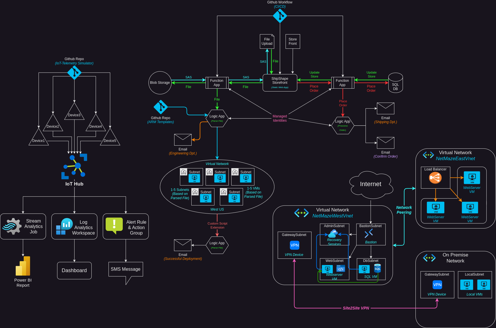

# ShipShape
This is my big AZ-104 project. I wanted to get hands on experience with everything covered in the [AZ-104 Azure Administration certification](https://learn.microsoft.com/en-us/credentials/certifications/azure-administrator/?practice-assessment-type=certification). Studying and reading is great, but I'm a hands on learner and I find it a lot more fun to dive in and create things myself using the skills I'm learning. I also wanted to improve my documentation skills, and so I tried to document every step of this process to the best of my ability. My aim for this repository is to demonstrate to employers my skillset, as well as my genuine interest in the subject matter. I also aim to give ideas to other people studying for the AZ-104 exam who would like to make a repo similar to this one. I want to give a shout out to [MadeByGPS](https://github.com/madebygps/projects/tree/main/az-104) for their repo providing inspiration for the ideas in this project.

This project includes 4 major sections that aim to cover all 5 of the objectives of the AZ-104 exam. The 5 objectives are:
- Manage Azure identities and governance
- Implement and manage storage
- Deploy and manage Azure compute resources
- Implement and manage virtual networking
- Monitor and maintain Azure resources

The overall topology looks like this:

# How to use this repo
This repo has 4 subdirectories:
	- [ShipShape-Website]() - This section of the project is the most in depth. In it, I create a website for a fictional company that uses 2 Azure Functions as the API. One function accepts a file upload, parses the file, and then runs through a series of logic checks and takes certain actions based on the contents of the file. The 2nd function is used to interact with an SQL database. The objectives focused on here are: *"Manage Azure identities and governance", "Implement and manage storage", "Deploy and manage Azure compute resources"* and *"Implement and manage virtual networking"*
	- [VMFleetCommander]() - This repo contains my `.bicep` files and ARM templates used for automated deployment of virtual network infrastructure and virtual machines. The objectives focused on here are: *"Deploy and manage Azure compute resources"* and *"Implement and manage virtual networking"*
	- [IoTHub]() - This repo contains the writeup for creating an IoT Hub as well as simulated IoT devices. The device telemetry is fed into various places for creating alerts, action groups, Power BI data visualizations, and a Log Analytics workspace. The objectives focused on here are: *"Monitor and maintain Azure resources"* and *"Deploy and manage Azure compute resources"*
	- [NetMaze]() - In this repo I deploy 2 virtual networks as well as an "on premise" network. The 2 Vnets are linked via network peering, and the on-premise network is linked with a Site 2 Site VPN. I also implement Azure Bastion and recovery services vault. The objectives focused on here are: *"Implement and manage virtual networking"* and *"Deploy and manage Azure compute resources"*
