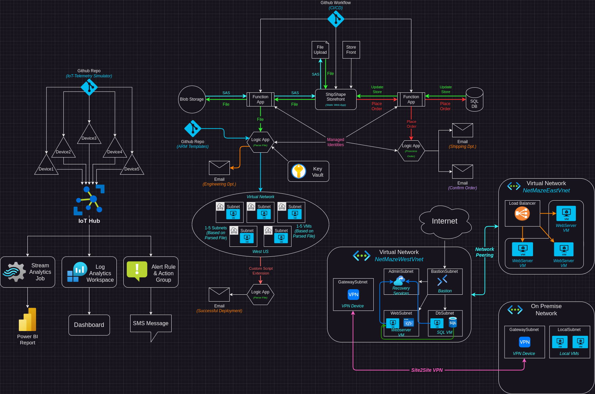

# ShipShape
This is my big AZ-104 project. I wanted to get hands on experience with everything covered in the [AZ-104 Azure Administration certification](https://learn.microsoft.com/en-us/credentials/certifications/azure-administrator/?practice-assessment-type=certification). Studying and reading is great, but I'm a hands on learner and I find it a lot more fun to dive in and create things myself using the skills I'm learning. I also wanted to improve my documentation skills, and so I tried to document every step of this process to the best of my ability. My aim for this repository is to demonstrate to employers my skillset, as well as my genuine interest in the subject matter. I also aim to give ideas to other people studying for the AZ-104 exam who would like to make a repo similar to this one. I want to give a shout out to [MadeByGPS](https://github.com/madebygps/projects/tree/main/az-104) for their repo providing inspiration for the ideas in this project.

This project includes 4 major sections that aim to cover all 5 of the objectives of the AZ-104 exam. The 5 objectives are:
- Manage Azure identities and governance
- Implement and manage storage
- Deploy and manage Azure compute resources
- Implement and manage virtual networking
- Monitor and maintain Azure resources

The overall topology looks like this:

# Overview
### Website
The project starts with creating a website hosted in an Azure Static Web App. The website uses 2 Azure Functions as an API. The first function accepts a `.json` file upload. The file extension and MIME type are checked, and the file name is sanitized against path traversal and command injection attacks. The file is then uploaded into blob storage. An SAS URL is generated that allows anyone with the link to download the file for 1 day.

The file is also sent from the Function to a Logic App. The Logic App parses the `.json` file. If any values in the `"Repairs"` field are, a virtual network and network security group are deployed. Depending on which values are true in the `"Repairs"` field are true, between 1-5 Subnets and virtual machines are deployed using ARM templates stored in a Github repo. The VMs are allowed to be accessed over SSH only, and the public SSH key for each VM is stored in a Key Vault that gets accessed at runtime. Once the VMs are deployed they use the Custom Script Extension to execute a simple task.

The website also uses a separate Function to interact with an SQL database. When the storefront is loaded the function retrieves the current inventory numbers from the database and updates the site accordingly. When a use places an order, the corresponding SQL database entry gets decremented by the ordered amount and the the site gets updated in real time to reflect these changes. The Function also sends the order information to a Logic App that will send a confirmation email to the user, and order information to the shipping department.

Following the principal of least privilege, all of the Function and Logic Apps operate with managed identities. This also allows easy development by using the `azure-identity` python module to dynamically switch authentication methods between development and production environments

A Github Workflow is used to implement a CI/CD pipeline, so that when a change is pushed to Github, the Static Web App and Function App will be automatically updated with the changes.
### IoT Hub
I created an IoT Hub with multiple simulated devices. I used the Azure [Raspberry Pi Simulator](https://azure-samples.github.io/raspberry-pi-web-simulator/) as well as the Azure [IoT Telemetry Simulator](https://github.com/azure-samples/iot-telemetry-simulator/tree/master/) to simulate telemetry from these devices. This telemetry gets monitored in a Stream Analytics Job that sends data to blob storage, as well as Power BI. Power BI is used to create powerful real time data visualizations for the incoming data.

The IoT Hub is also monitored by a Log Analytics workspace that can be used to monitor information like the connect/disconnect ratio of various devices, amount of error message thrown, and general activity levels of the devices.

I also set up an alert with an action group that will send out SMS messages to certain administrators when various conditions are met.
### Networking
In this section I deployed 2 virtual networks. Vnet1 contains a *WebSubnet*, *DbSubnet*, and *AdminSubnet*. The *WebSubnet* contains a VM running an Nginx webserver. The *DbSubnet* contains and SQL Server VM. The *AdminSubnet* contains a Recovery Services Vault. Vnet2 contains a Load Balancer as well as 3 simple webservers. The virtual networks are peered. The webserver in the 1st Vnet updates it's website with data from the SQL Server VM as well as the 3 VMs behind the Load balancer. 

Vnet1 also contains a Bastion subnet, which allows remote access into the network without having to assign any of the VMs with a public IP address.

Both virtual networks are peered, allowing communication between both networks, allowing all VMs in both networks to be backed up to the Recovery Services Vault in Vnet1, and allowing the Bastion in Vnet1 to provide access to Vnet2.

I deployed another Vnet meant to act as my "local network." I deployed a Virtual Network Gateway to LocalVnet and Vnet1. I then configured a Vnet-to-Vnet VPN to allow communication between the 2 networks. I configured the VPN to allow forwarded traffic into and out of Vnet2, that way I can access my cloud networks via a VPN connection from my "on-premise" datacenter.

# How to use this repo
This repo has 4 subdirectories:
- [ShipShape-Website]() - This section of the project is the most in depth. In it, I create a website for a fictional company that uses 2 Azure Functions as the API. One function accepts a file upload, parses the file, and then runs through a series of logic checks and takes certain actions based on the contents of the file. The 2nd function is used to interact with an SQL database. **The objectives focused on here are:** *"Manage Azure identities and governance", "Implement and manage storage", "Deploy and manage Azure compute resources"* and *"Implement and manage virtual networking"*
- [VMFleetCommander]() - This repo contains my `.bicep` files and ARM templates used for automated deployment of virtual network infrastructure and virtual machines. **The objectives focused on here are:** *"Deploy and manage Azure compute resources"* and *"Implement and manage virtual networking"*
- [IoTHub]() - This repo contains the writeup for creating an IoT Hub as well as simulated IoT devices. The device telemetry is fed into various places for creating alerts, action groups, Power BI data visualizations, and a Log Analytics workspace. **The objectives focused on here are:** *"Monitor and maintain Azure resources"* and *"Deploy and manage Azure compute resources"*
- [NetMaze]() - In this repo I deploy 2 virtual networks as well as an "on premise" network. The 2 Vnets are linked via network peering, and the on-premise network is linked with a Site 2 Site VPN. I also implement Azure Bastion and recovery services vault. **The objectives focused on here are:** *"Implement and manage virtual networking"* and *"Deploy and manage Azure compute resources"*
